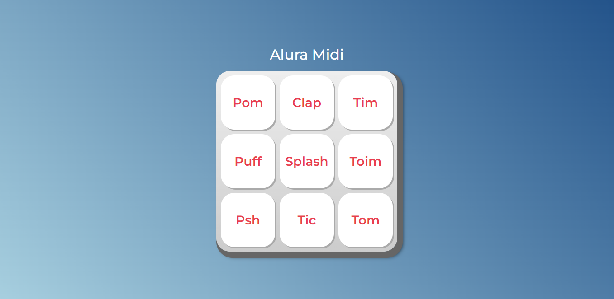

# JavaScript para Web: Crie páginas dinâmicas (Alura)

    Carga Horária: 10h

## Conteúdo aprendido:

* Identificar os papéis de cada tecnologia da Web para construção de páginas;
* Associar o JavaScript com HTML através do DOM;
* Implementar funções com JavaScript;
* Investigar possibilidades de resolução de problemas de código;
* Selecionar operadores lógicos adequados para diferentes situações;
* Produzir soluções simples para páginas dinâmicas.

## Certificado:
<a href="https://cursos.alura.com.br/certificate/fd3f7df6-2868-4c50-8732-3a6593d18cfd">Link de acesso</a>

## Página do Alura Midi:

